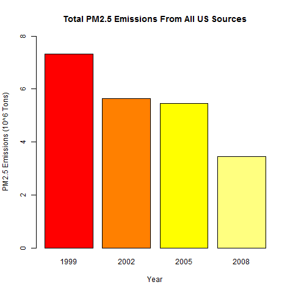
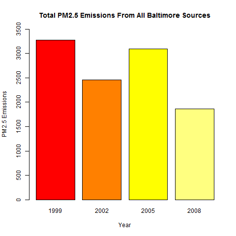
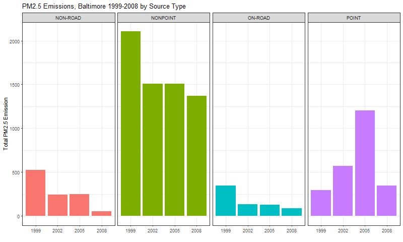
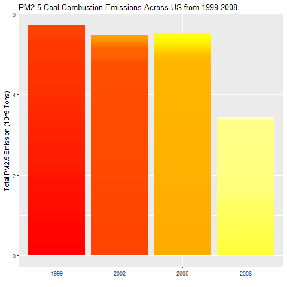
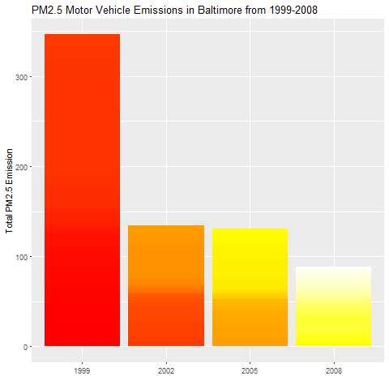
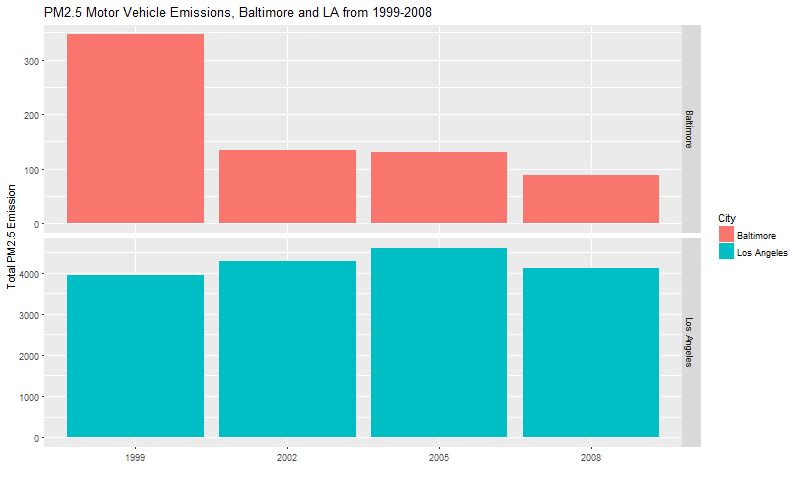

## Assignment Submission - Semana 4

[Regresar a Notas](../README.md#semana-4)

### Data Preprocess

* [week4.R](week4.R)

````Rscript
week4 = function() {

  # Load requiered libs
  loadLibs()

  # Download dataset
  datasetDest = downloadDataset()

  # Extract Dataset
  extract(datasetDest)

  NEIName = "NEI_data/summarySCC_PM25.rds"
  SCCName = "NEI_data/Source_Classification_Code.rds"
  toGlobal(NEIName)
  toGlobal(SCCName)

  # Read all the dataset
  print(paste("Reading file", NEIName))
  NEI = readRDS(NEIName)
  toGlobal(NEI)

  print(paste("Reading file", SCCName))
  SCC = readRDS(SCCName)
  toGlobal(SCC)
}

downloadDataset = function() {
  datasetUrl = "https://d396qusza40orc.cloudfront.net/exdata%2Fdata%2FNEI_data.zip"
  datasetDest = download(datasetUrl, "NEI_data.zip")
  return(datasetDest)
}

# Assign to global environment
toGlobal = function(var) {
  name = deparse(substitute(var))
  assign(name, var, .GlobalEnv)
}

# Extract zip function
extract = function(zipfile) {
  print(paste("Unziping", zipfile))
  unzip(zipfile, files = NULL, list = FALSE,
        overwrite = TRUE, junkpaths = FALSE, exdir = "./NEI_data",
        unzip = "internal", setTimes = FALSE)
}


# Download function
download = function(url, name) {
  dirDownload = "NEI_data/"

  if(!dir.exists(dirDownload)) {
    dir.create(dirDownload)
  }

  dest = paste(dirDownload, name, sep= "")

  if(!file.exists(dest)) {
    print(paste("Downloading", dest))
    download.file(url, destfile=dest, method="wininet", mode = "wb")
  }

  return(dest)
}

# Load libs
loadLibs = function() {

  if(!require(ggplot2)){
    install.packages("ggplot2")
  }

  library(ggplot2)
}
````

### Assignment

1. Have total emissions from PM2.5 decreased in the United States from 1999 to 2008? Using the **base** plotting system, make a plot showing the **total PM2.5** emission from all sources for each of the years 1999, 2002, 2005, and 2008.

* [plot1.R](plot1.R)

````Rscript
plot1 = function() {
  # plot1.png 480x480 px
  png("plot1.png", width = 480, height = 480, units = "px")

  # Aggregate total PM2.5 by year
  aggByYear = aggregate(Emissions~year, NEI, sum)

  # Create plot1
  barplot(
    (aggByYear$Emissions)/10^6,
    names.arg = aggByYear$year,
    col = heat.colors(4),
    ylim = c(0, 8),
    xlab="Year",
    ylab="PM2.5 Emissions (10^6 Tons)",
    main="Total PM2.5 Emissions From All US Sources"
  )

  # PNG Device Off
  dev.off()  
}
````



2. Have total emissions from PM2.5 decreased in the Baltimore City, Maryland (fips == "24510") from 1999 to 2008? Use the base plotting system to make a plot answering this question.

* [plot2.R](plot2.R)

````Rscript
plot2 = function() {
  # plot2.png 480x480 px
  png("plot2.png", width = 480, height = 480, units = "px")

  # Subset of baltimore
  baltimore = subset(NEI, fips == "24510")

  # Aggregate total PM2.5 by year
  aggBaltByYear = aggregate(Emissions~year, baltimore, sum)

  # Create plot2
  barplot(
    aggBaltByYear$Emissions,
    names.arg = aggBaltByYear$year,
    col = heat.colors(4),
    ylim = c(0, 3500),
    xlab="Year",
    ylab="PM2.5 Emissions",
    main="Total PM2.5 Emissions From All Baltimore Sources"
  )

  # PNG Device Off
  dev.off()  
}
````



3. Of the four types of sources indicated by the type (point, nonpoint, onroad, nonroad) variable, which of these four sources have seen decreases in emissions from 1999–2008 for Baltimore City? Which have seen increases in emissions from 1999–2008? Use the ggplot2 plotting system to make a plot answer this question.

* [plot3.R](plot3.R)

````Rscript
plot3 = function() {
  # plot3.png 800x480 px
  png("plot3.png", width = 800, height = 480, units = "px")

  # Subset of baltimore
  baltimore = subset(NEI, fips == "24510")

  # Create plot3
  p3 = ggplot(baltimore, aes(factor(year), Emissions, fill=type)) +
        geom_bar(stat="identity") +
        theme_bw() + guides(fill=FALSE) +
        facet_grid(.~type,scales = "free",space="free") +
        labs(x="", y="Total PM2.5 Emission") +
        labs(title="PM2.5 Emissions, Baltimore 1999-2008 by Source Type")

  print(p3)

  # PNG Device Off
  dev.off()
}
````



4. Across the United States, how have emissions from coal combustion-related sources changed from 1999–2008?

* [plot4.R](plot4.R)

````Rscript
plot4 = function() {
  # plot4.png 480x480 px
  png("plot4.png", width = 480, height = 480, units = "px")

  # Subset coal combustion related NEI data
  coal = grepl("coal", SCC$EI.Sector, ignore.case=TRUE)
  coalSCC = SCC[coal,]$SCC
  subsetCoal = NEI[NEI$SCC %in% coalSCC,]

  # Create plot4
  p4 = ggplot(subsetCoal, aes(x=factor(year), y=Emissions/10^5)) +
        geom_bar(stat="identity", fill=heat.colors(length(subsetCoal$Emissions))) +
        labs(x="", y="Total PM2.5 Emission (10^5 Tons)") +
        labs(title="PM2.5 Coal Combustion Emissions Across US from 1999-2008")

  print(p4)

  # PNG Device Off
  dev.off()  
}
````



5. How have emissions from motor vehicle sources changed from 1999–2008 in Baltimore City?

* [plot5.R](plot5.R)

````Rscript
plot5 = function() {
  # plot5.png 480x480 px
  png("plot5.png", width = 480, height = 480, units = "px")

  # Subset motor vehicles related NEI data
  subsetVehBalt = subset(NEI, (fips == "24510") & type == "ON-ROAD")

  # Create plot5
  p5 = ggplot(subsetVehBalt, aes(x=factor(year), y=Emissions)) +
    geom_bar(stat="identity", fill=heat.colors(length(subsetVehBalt$Emissions))) +
    labs(x="", y="Total PM2.5 Emission") +
    labs(title="PM2.5 Motor Vehicle Emissions in Baltimore from 1999-2008")

  print(p5)

  # PNG Device Off
  dev.off()  
}
````



6. Compare emissions from motor vehicle sources in Baltimore City with emissions from motor vehicle sources in Los Angeles County, California (fips == "06037"). Which city has seen greater changes over time in motor vehicle emissions?

* [plot6.R](plot6.R)

````Rscript
plot6 = function() {
  # plot6.png 800x480 px
  png("plot6.png", width = 800, height = 480, units = "px")

  # Subset motor vehicles related NEI data
  subsetBaLA = subset(NEI, (fips == "24510" | fips == "06037") & type == "ON-ROAD")
  subsetBaLA$City = ifelse(subsetBaLA$fips == "24510", "Baltimore", "Los Angeles")

  # Create plot6
  p6 = ggplot(subsetBaLA, aes(x=factor(year), y=Emissions, fill=City)) +
    geom_bar(stat="identity") +
    facet_grid(City  ~ ., scales="free") +
    labs(x="", y="Total PM2.5 Emission") +
    labs(title="PM2.5 Motor Vehicle Emissions, Baltimore and LA from 1999-2008")

  print(p6)

  # PNG Device Off
  dev.off()  
}
````



[Regresar a Notas](../README.md#semana-4)
