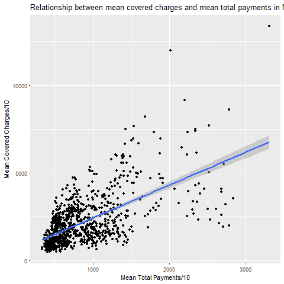
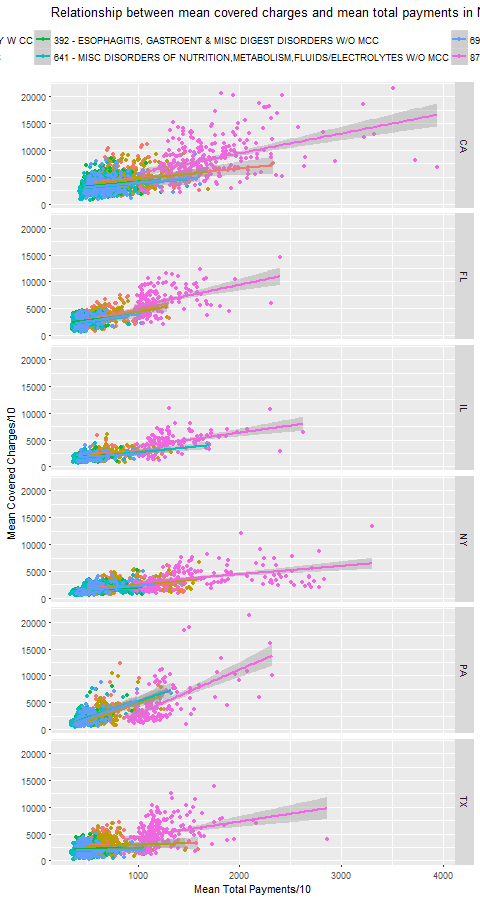

# Practice Peer-graded Assignment: Plotting practice

[Regresar a Notas](../README.md#semana-1)

## Instructions

To practice the plotting techniques you have learned so far, you will be making a graphic that explores relationships between variables. This practice is useful since we will later cover creating reproducible graphics in this class. You will be looking at a subset of a United States medical expenditures dataset with information on costs for different medical conditions and in different areas of the country.

You should do the following:

1. Make a plot that answers the question: what is the relationship between mean covered charges (Average.Covered.Charges) and mean total payments (Average.Total.Payments) in New York?

2. Make a plot (possibly multi-panel) that answers the question: how does the relationship between mean covered charges (Average.Covered.Charges) and mean total payments (Average.Total.Payments) vary by medical condition (DRG.Definition) and the state in which care was received (Provider.State)?

**Use only the ggplot2 graphics system (not base R or lattice) to make your figure.**

Please submit (1) R code that creates your plots, (2) a single pdf for plot 1 and (3) a single pdf for plot 2. You will be graded on whether you answered the questions and a number of features describing the clarity of the plots including axis labels, figure legends, figure captions, and plots. For guidelines on how to create production quality plots see Chapter 10 of the [Elements of Data Analytic Style](https://leanpub.com/datastyle) ([https://www.dropbox.com/s/rybd14gq60jzira/edas_chapter10.pdf?dl=0](https://www.dropbox.com/s/rybd14gq60jzira/edas_chapter10.pdf?dl=0))

To make the plots use the data in the attached .csv file. These data are a processed version of the data from the site: [https://data.cms.gov/Medicare/Inpatient-Prospective-Payment-System-IPPS-Provider/97k6-zzx3](https://data.cms.gov/Medicare/Inpatient-Prospective-Payment-System-IPPS-Provider/97k6-zzx3)

## Code and results

* [week1.R](week1.R)
* [plot1.pdf](plot1.pdf)
* [plot2.pdf](plot2.pdf)

[Regresar a Notas](../README.md#semana-1)
