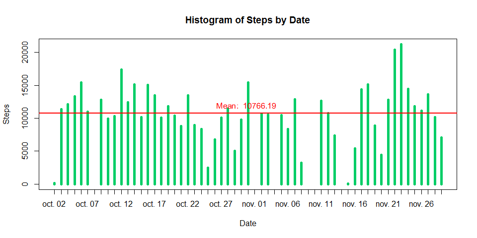
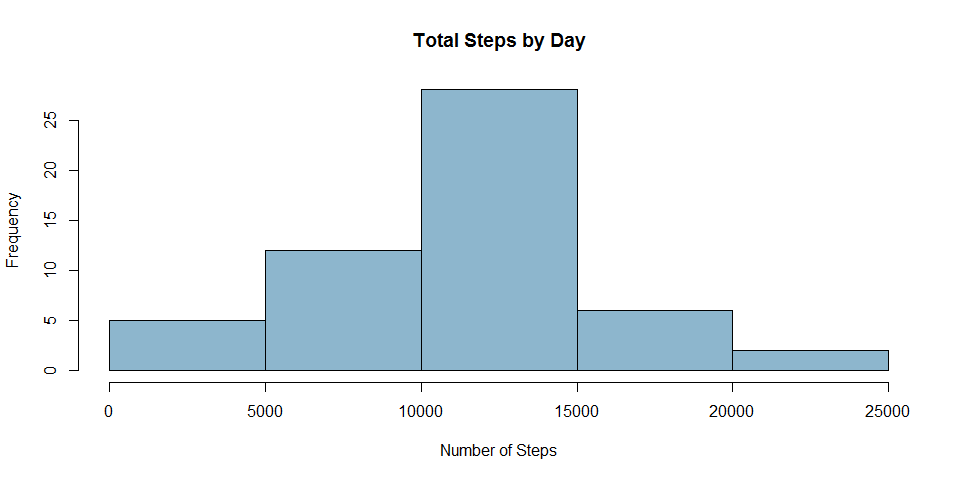
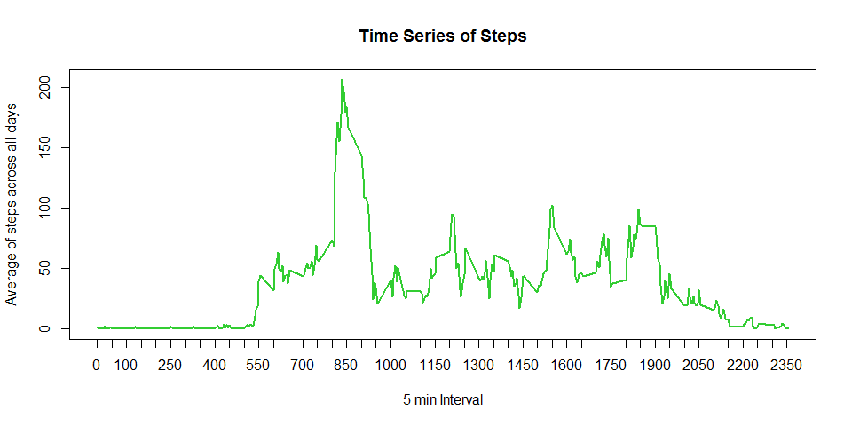
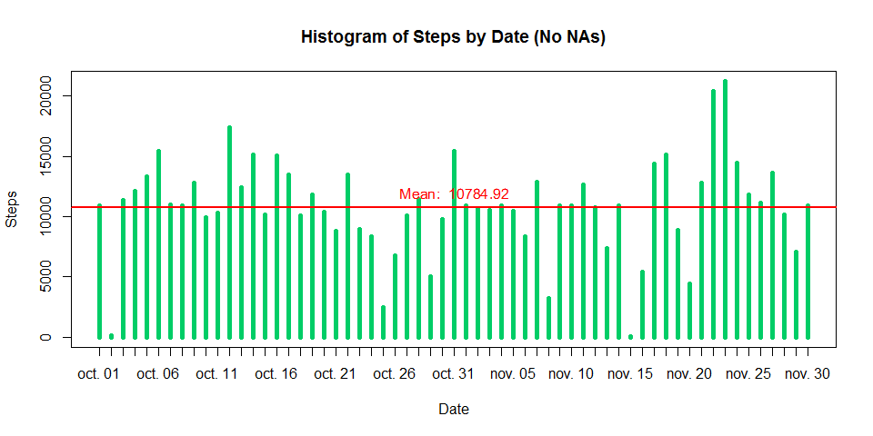
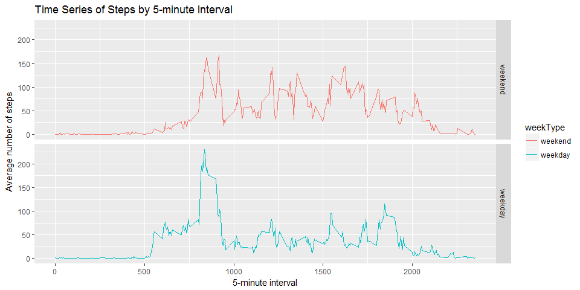

# Reproducible Research: Peer Assessment 1
Ignacio Sandoval  

## Requiered Libraries

* lubridate
* ggplot2


## Loading and preprocessing the data

The following code will download **activity.zip** from:

* Dataset: [Activity monitoring data](https://d396qusza40orc.cloudfront.net/repdata%2Fdata%2Factivity.zip) [52K]

After that, code will unzip the file and read the CSV.


```r
  # URL to download activity.zip
  datasetUrl = "https://d396qusza40orc.cloudfront.net/repdata%2Fdata%2Factivity.zip"
  zipName = "activity.zip"
  
  # If file doesn't exist, download it
  if (!file.exists(zipName)) {
    download.file(datasetUrl,
                  destfile = zipName,
                  method = "wininet",
                  mode = "wb")
  }
  
  # Upzip activity.zip
  unzip(zipName)
  
  # Read activity.csv
  data = read.csv("activity.csv")
  
  # Head of data
  head(data)
```

```
##   steps       date interval
## 1    NA 2012-10-01        0
## 2    NA 2012-10-01        5
## 3    NA 2012-10-01       10
## 4    NA 2012-10-01       15
## 5    NA 2012-10-01       20
## 6    NA 2012-10-01       25
```

Next steps are to perform the data transformation of the date column.

1. Verify data type of date column:

```r
  # Verify data type of date column:
  str(data$date)
```

```
##  Factor w/ 61 levels "2012-10-01","2012-10-02",..: 1 1 1 1 1 1 1 1 1 1 ...
```

2. Transfor the date column to Date data type:

```r
  # Transform from Factor to Date
  data$date = as.Date(data$date, format = "%Y-%m-%d")
```

3. Verify data type of date column:

```r
  # Verify data type of date column:
  str(data$date)
```

```
##  Date[1:17568], format: "2012-10-01" "2012-10-01" "2012-10-01" "2012-10-01" "2012-10-01" ...
```

## What is mean total number of steps taken per day?

1. Calculate the total number of steps taken per day

```r
  # Calculate the steps by day
  stepsByDay = aggregate(steps ~ date, data, sum)
  
  # Head of stepsByDay
  head(stepsByDay)
```

```
##         date steps
## 1 2012-10-02   126
## 2 2012-10-03 11352
## 3 2012-10-04 12116
## 4 2012-10-05 13294
## 5 2012-10-06 15420
## 6 2012-10-07 11015
```

```r
  # Validate NA for stepsByDay
  any(is.na(stepsByDay))
```

```
## [1] FALSE
```

2. Make a histogram of the total number of steps taken each day

```r
  # Create plot steps by day
  plot(
    stepsByDay$date,
    stepsByDay$steps,
    type = "h",
    main = "Histogram of Steps by Date",
    xlab = "Date",
    ylab = "Steps",
    col = "springgreen3",
    lwd = 5,
    xaxt="n"
  )

  # Axis by day
  axis.Date(1, at = seq(min(stepsByDay$date), max(stepsByDay$date), by = "day"))
  
  # Mean of the steps
  abline(h = mean(stepsByDay$steps),
         col = "red",
         lwd = 2)
  
  # Print value of the mean
  text(
    mean(stepsByDay$date),
    mean(stepsByDay$steps),
    paste("Mean: ", round(mean(stepsByDay$steps), digits = 2)),
    srt = 0.2,
    pos = 3,
    col = "red"
  )
```

<!-- -->


```r
  # Create histogram with the frequency of steps
  hist(stepsByDay$steps,
       col = "lightskyblue3",
       main = "Total Steps by Day",
       xlab = "Number of Steps")
```

<!-- -->


3. Calculate and report the mean and median of the total number of steps taken per day

**Summary of Steps By day:**

```r
  # Summary of steps by day
  summary(stepsByDay)
```

```
##       date                steps      
##  Min.   :2012-10-02   Min.   :   41  
##  1st Qu.:2012-10-16   1st Qu.: 8841  
##  Median :2012-10-29   Median :10765  
##  Mean   :2012-10-30   Mean   :10766  
##  3rd Qu.:2012-11-16   3rd Qu.:13294  
##  Max.   :2012-11-29   Max.   :21194
```

**Mean of steps:**

```r
  # Mean of steps
  mean(stepsByDay$steps)
```

```
## [1] 10766.19
```

**Median of steps:**

```r
  # Meadian of steps
  median(stepsByDay$steps)
```

```
## [1] 10765
```

## What is the average daily activity pattern?

1. Make a time series plot (i.e. type = "l") of the 5-minute interval (x-axis) and the average number of steps taken, averaged across all days (y-axis)


```r
  # Calculate the steps by interval
  stepsByInterval = aggregate(steps ~ interval, data, mean)

  # Head of stepsByInterval
  head(stepsByInterval)
```

```
##   interval     steps
## 1        0 1.7169811
## 2        5 0.3396226
## 3       10 0.1320755
## 4       15 0.1509434
## 5       20 0.0754717
## 6       25 2.0943396
```

```r
  # Validate NA for stepsByInterval
  any(is.na(stepsByInterval))
```

```
## [1] FALSE
```


```r
  # Create time series plot
  plot(
    stepsByInterval$interval,
    stepsByInterval$steps,
    type = "l",
    main = "Time Series of Steps",
    xlab = "5 min Interval",
    ylab = "Average of steps across all days",
    col = "limegreen",
    lwd = 2,
    xaxt="n"
  )

  axis(1, at = seq(min(stepsByInterval$interval), max(stepsByInterval$interval), by = 50))
```

<!-- -->

2. Which 5-minute interval, on average across all the days in the dataset, contains the maximum number of steps?


```r
  # Maximum number os steps
  stepsByInterval[which.max(stepsByInterval$steps),]
```

```
##     interval    steps
## 104      835 206.1698
```

## Imputing missing values

Note that there are a number of days/intervals where there are missing values (coded as NA). The presence of missing days may introduce bias into some calculations or summaries of the data.

1. Calculate and report the total number of missing values in the dataset (i.e. the total number of rows with NAs)


```r
  # Total number of rows with NA
  sum(is.na(data$steps))
```

```
## [1] 2304
```

2. Devise a strategy for filling in all of the missing values in the dataset. The strategy does not need to be sophisticated. For example, you could use the mean/median for that day, or the mean for that 5-minute interval, etc.

Prepare dataframe for strategy: **mean for that 5-minute interval**.


```r
  # Create a copy of stepsByInterval
  roundStepsByInterval = cbind(stepsByInterval)
  
  # Round (ceiling) to remove decimals
  roundStepsByInterval$steps = ceiling(roundStepsByInterval$steps)
```

3. Create a new dataset that is equal to the original dataset but with the missing data filled in.


```r
  # Create a copy of data
  dataNoNA = cbind(data)

  # Set average steps by interval if steps is NA
  dataNoNA$steps = ifelse(is.na(dataNoNA$steps),
                   roundStepsByInterval$steps[roundStepsByInterval$interval 
                                              %in% dataNoNA$interval],
                   dataNoNA$steps)
```

4. Make a histogram of the total number of steps taken each day and Calculate and report the mean and median total number of steps taken per day. 


```r
  # Calculate the steps by day (No NAs)
  stepsByDayNoNA = aggregate(steps ~ date, dataNoNA, sum)
 
  # Create plot steps by day (No NAs)
  plot(
    stepsByDayNoNA$date,
    stepsByDayNoNA$steps,
    type = "h",
    main = "Histogram of Steps by Date (No NAs)",
    xlab = "Date",
    ylab = "Steps",
    col = "springgreen3",
    lwd = 5,
    xaxt="n"
  )

  # Axis by day
  axis.Date(1, at = seq(min(stepsByDayNoNA$date), max(stepsByDayNoNA$date), by = "day"))
  
  # Mean of the steps
  abline(h = mean(stepsByDayNoNA$steps),
         col = "red",
         lwd = 2)
  
  # Print value of the mean
  text(
    mean(stepsByDayNoNA$date),
    mean(stepsByDayNoNA$steps),
    paste("Mean: ", round(mean(stepsByDayNoNA$steps), digits = 2)),
    srt = 0.2,
    pos = 3,
    col = "red"
  )
```

<!-- -->

4.1 Do these values differ from the estimates from the first part of the assignment?

**Summary of Steps By day (No NAs):**

```r
  # Summary of steps by day (No NAs)
  summary(stepsByDayNoNA)
```

```
##       date                steps      
##  Min.   :2012-10-01   Min.   :   41  
##  1st Qu.:2012-10-16   1st Qu.: 9819  
##  Median :2012-10-31   Median :10909  
##  Mean   :2012-10-31   Mean   :10785  
##  3rd Qu.:2012-11-15   3rd Qu.:12811  
##  Max.   :2012-11-30   Max.   :21194
```

**Mean of steps vs Mean of Steps (No NAs):**

```r
  # Mean of steps
  mean(stepsByDay$steps)
```

```
## [1] 10766.19
```

```r
  # Mean of steps (No NAs)
  mean(stepsByDayNoNA$steps)
```

```
## [1] 10784.92
```

**Median of steps vs Median of steps (No NAs):**

```r
  # Meadian of steps
  median(stepsByDay$steps)
```

```
## [1] 10765
```

```r
  # Meadian of steps (No NAs)
  median(stepsByDayNoNA$steps)
```

```
## [1] 10909
```

4.2 What is the impact of imputing missing data on the estimates of the total daily number of steps?

It depends of the strategy selected to fill the NA values, in my case I have filled this NA values with the **mean for that 5-minute interval**, and also performing a round ceiling to these values in order to remove the decimals. This transformation creates an **increase of the Mean and the Median**.

If you skip the round of the values, **the median and mean will remain the same**.


```r
  # Don´t Round (ceiling) to remove decimals
  # roundStepsByInterval$steps = ceiling(roundStepsByInterval$steps)

  # Create a copy of data
  dataNoNA2 = cbind(data)

  # Set average steps by interval if steps is NA
  dataNoNA2$steps = ifelse(is.na(dataNoNA2$steps),
                   stepsByInterval$steps[stepsByInterval$interval %in% dataNoNA2$interval],
                   dataNoNA2$steps)
  
  # Calculate the steps by day (No NAs)
  stepsByDayNoNA2 = aggregate(steps ~ date, dataNoNA2, sum)
```

**Summary of Steps By day (No NAs/No Round):**

```r
  # Summary of steps by day (No NAs/No Round)
  summary(stepsByDayNoNA2)
```

```
##       date                steps      
##  Min.   :2012-10-01   Min.   :   41  
##  1st Qu.:2012-10-16   1st Qu.: 9819  
##  Median :2012-10-31   Median :10766  
##  Mean   :2012-10-31   Mean   :10766  
##  3rd Qu.:2012-11-15   3rd Qu.:12811  
##  Max.   :2012-11-30   Max.   :21194
```

**Summary of Steps By day (With NAs):**

```r
  # Summary of steps by day (With NAs)
  summary(stepsByDay)
```

```
##       date                steps      
##  Min.   :2012-10-02   Min.   :   41  
##  1st Qu.:2012-10-16   1st Qu.: 8841  
##  Median :2012-10-29   Median :10765  
##  Mean   :2012-10-30   Mean   :10766  
##  3rd Qu.:2012-11-16   3rd Qu.:13294  
##  Max.   :2012-11-29   Max.   :21194
```

## Are there differences in activity patterns between weekdays and weekends?

1. Create a new factor variable in the dataset with two levels -- "weekday" and "weekend" indicating whether a given date is a weekday or weekend day.


```r
  # wday returns the day of the week as a decimal number (01-07, Sunday is 1).
  dataNoNA$weekType = factor((wday(dataNoNA$date) %in% c(1, 7)),
                             levels = c(TRUE, FALSE),
                             labels = c('weekend', 'weekday'))
```

2. Make a panel plot containing a time series plot (i.e. type = "l") of the 5-minute interval (x-axis) and the average number of steps taken, averaged across all weekday days or weekend days (y-axis).


```r
  # Calculate the steps by day (No NAs)
  stepsByIntervalW = aggregate(steps ~ interval+weekType, dataNoNA, mean)

  ggplot(stepsByIntervalW, aes(interval, steps)) +
         geom_line(aes(colour = weekType)) +
         facet_grid(weekType ~ .) +
         labs(x = "5-minute interval", y = "Average number of steps") +
         ggtitle("Time Series of Steps by 5-minute Interval")
```

<!-- -->
