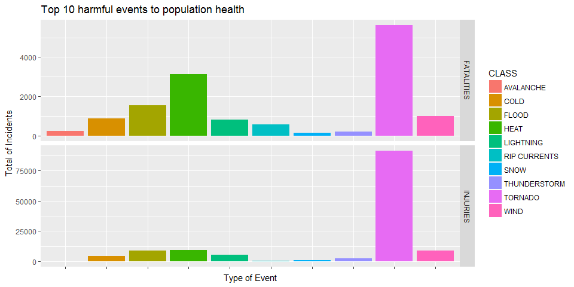
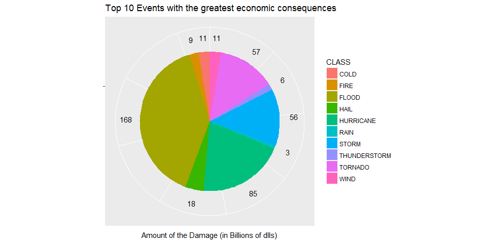

# The Most Harmful Natural Events to Population Health and the Economic Consequences
Ignacio Sandoval  
2017-06-25  

## Synopsis

This project involves exploring the U.S. National Oceanic and Atmospheric Administration's (NOAA) storm database. This database tracks characteristics of major storms and weather events in the United States, including when and where they occur, as well as estimates of any fatalities, injuries, and property damage.

This analysis is to determine the natural events who are the most harmful to population health and those events with the greatest economic consequences.

## Data Processing

### Required Libraries

Below are the libraries Required to perform the data transformation and analysis are:

* **lubridate:** Used to date manipulation.
* **dplyr:** Used to Data Manipulation.
* **ggplot2:** Used to create the plots.
* **reshape2:** Used to melt data frame.


```r
  # Install lubridate library
  if(!require(lubridate)){
    install.packages("lubridate", repos = "https://cran.rstudio.com/")
  }

  # Install dplyr library
  if(!require(dplyr)){
    install.packages("dplyr", repos = "https://cran.rstudio.com/")
  }

  # Install ggplot2 library
  if(!require(ggplot2)){
    install.packages("ggplot2", repos = "https://cran.rstudio.com/")
  }

  # Install reshape2 library
  if(!require(reshape2)){
    install.packages("reshape2", repos = "https://cran.rstudio.com/")
  }
```

### Loading the data

The following code will download the file **StormData.csv.bz2** from:

* [Storm Data](https://d396qusza40orc.cloudfront.net/repdata%2Fdata%2FStormData.csv.bz2) [47Mb]

After file has been downloaded, code will read the compressed CSV.


```r
  # URL to download StormData.csv.bz2
  datasetUrl = "https://d396qusza40orc.cloudfront.net/repdata%2Fdata%2FStormData.csv.bz2"
  zipName = "StormData.csv.bz2"
  
  # If file doesn't exist, download it
  if (!file.exists(zipName)) {
    download.file(datasetUrl,
                  destfile = zipName,
                  method = "wininet",
                  mode = "wb")
  }

  # Read StormData.csv
  data = read.csv(zipName)
  
  # Structure of data
  str(data)
```

```
## 'data.frame':	902297 obs. of  37 variables:
##  $ STATE__   : num  1 1 1 1 1 1 1 1 1 1 ...
##  $ BGN_DATE  : Factor w/ 16335 levels "1/1/1966 0:00:00",..: 6523 6523 4242 11116 2224 2224 2260 383 3980 3980 ...
##  $ BGN_TIME  : Factor w/ 3608 levels "00:00:00 AM",..: 272 287 2705 1683 2584 3186 242 1683 3186 3186 ...
##  $ TIME_ZONE : Factor w/ 22 levels "ADT","AKS","AST",..: 7 7 7 7 7 7 7 7 7 7 ...
##  $ COUNTY    : num  97 3 57 89 43 77 9 123 125 57 ...
##  $ COUNTYNAME: Factor w/ 29601 levels "","5NM E OF MACKINAC BRIDGE TO PRESQUE ISLE LT MI",..: 13513 1873 4598 10592 4372 10094 1973 23873 24418 4598 ...
##  $ STATE     : Factor w/ 72 levels "AK","AL","AM",..: 2 2 2 2 2 2 2 2 2 2 ...
##  $ EVTYPE    : Factor w/ 985 levels "   HIGH SURF ADVISORY",..: 834 834 834 834 834 834 834 834 834 834 ...
##  $ BGN_RANGE : num  0 0 0 0 0 0 0 0 0 0 ...
##  $ BGN_AZI   : Factor w/ 35 levels "","  N"," NW",..: 1 1 1 1 1 1 1 1 1 1 ...
##  $ BGN_LOCATI: Factor w/ 54429 levels "","- 1 N Albion",..: 1 1 1 1 1 1 1 1 1 1 ...
##  $ END_DATE  : Factor w/ 6663 levels "","1/1/1993 0:00:00",..: 1 1 1 1 1 1 1 1 1 1 ...
##  $ END_TIME  : Factor w/ 3647 levels ""," 0900CST",..: 1 1 1 1 1 1 1 1 1 1 ...
##  $ COUNTY_END: num  0 0 0 0 0 0 0 0 0 0 ...
##  $ COUNTYENDN: logi  NA NA NA NA NA NA ...
##  $ END_RANGE : num  0 0 0 0 0 0 0 0 0 0 ...
##  $ END_AZI   : Factor w/ 24 levels "","E","ENE","ESE",..: 1 1 1 1 1 1 1 1 1 1 ...
##  $ END_LOCATI: Factor w/ 34506 levels "","- .5 NNW",..: 1 1 1 1 1 1 1 1 1 1 ...
##  $ LENGTH    : num  14 2 0.1 0 0 1.5 1.5 0 3.3 2.3 ...
##  $ WIDTH     : num  100 150 123 100 150 177 33 33 100 100 ...
##  $ F         : int  3 2 2 2 2 2 2 1 3 3 ...
##  $ MAG       : num  0 0 0 0 0 0 0 0 0 0 ...
##  $ FATALITIES: num  0 0 0 0 0 0 0 0 1 0 ...
##  $ INJURIES  : num  15 0 2 2 2 6 1 0 14 0 ...
##  $ PROPDMG   : num  25 2.5 25 2.5 2.5 2.5 2.5 2.5 25 25 ...
##  $ PROPDMGEXP: Factor w/ 19 levels "","-","?","+",..: 17 17 17 17 17 17 17 17 17 17 ...
##  $ CROPDMG   : num  0 0 0 0 0 0 0 0 0 0 ...
##  $ CROPDMGEXP: Factor w/ 9 levels "","?","0","2",..: 1 1 1 1 1 1 1 1 1 1 ...
##  $ WFO       : Factor w/ 542 levels ""," CI","$AC",..: 1 1 1 1 1 1 1 1 1 1 ...
##  $ STATEOFFIC: Factor w/ 250 levels "","ALABAMA, Central",..: 1 1 1 1 1 1 1 1 1 1 ...
##  $ ZONENAMES : Factor w/ 25112 levels "","                                                                                                               "| __truncated__,..: 1 1 1 1 1 1 1 1 1 1 ...
##  $ LATITUDE  : num  3040 3042 3340 3458 3412 ...
##  $ LONGITUDE : num  8812 8755 8742 8626 8642 ...
##  $ LATITUDE_E: num  3051 0 0 0 0 ...
##  $ LONGITUDE_: num  8806 0 0 0 0 ...
##  $ REMARKS   : Factor w/ 436781 levels "","-2 at Deer Park\n",..: 1 1 1 1 1 1 1 1 1 1 ...
##  $ REFNUM    : num  1 2 3 4 5 6 7 8 9 10 ...
```

### Data transformation

#### Relevant Variables

The first step for this analysis, is to reduce the dimension of the data set to only those variables who are relevant.

The relevant variables are:

* **BGN_DATE:** Begin date of the event.
* **BGN_TIME:** Begin time of the event.
* **STATE:** State where the event occurred.
* **EVTYPE:** Type of event.
* **FATALITIES:** Number of fatalities.
* **INJURIES:** Number of persons with injuries.
* **PROPDMG:** Property damage estimate in dollar amounts.
* **PROPDMGEXP:** Alphabetical characters used to signify magnitude include "K" for thousands, "M" for millions, and "B" for billions. 


```r
  # Subset of relevant variables if there are values > 0
  dataRelevant = subset(data, 
                        FATALITIES > 0 | INJURIES > 0 | PROPDMG > 0,
                        select = c(BGN_DATE, BGN_TIME, STATE, EVTYPE, 
                                   FATALITIES, INJURIES, PROPDMG, PROPDMGEXP))

  # Structure of dataRelevant
  str(dataRelevant)
```

```
## 'data.frame':	248802 obs. of  8 variables:
##  $ BGN_DATE  : Factor w/ 16335 levels "1/1/1966 0:00:00",..: 6523 6523 4242 11116 2224 2224 2260 383 3980 3980 ...
##  $ BGN_TIME  : Factor w/ 3608 levels "00:00:00 AM",..: 272 287 2705 1683 2584 3186 242 1683 3186 3186 ...
##  $ STATE     : Factor w/ 72 levels "AK","AL","AM",..: 2 2 2 2 2 2 2 2 2 2 ...
##  $ EVTYPE    : Factor w/ 985 levels "   HIGH SURF ADVISORY",..: 834 834 834 834 834 834 834 834 834 834 ...
##  $ FATALITIES: num  0 0 0 0 0 0 0 0 1 0 ...
##  $ INJURIES  : num  15 0 2 2 2 6 1 0 14 0 ...
##  $ PROPDMG   : num  25 2.5 25 2.5 2.5 2.5 2.5 2.5 25 25 ...
##  $ PROPDMGEXP: Factor w/ 19 levels "","-","?","+",..: 17 17 17 17 17 17 17 17 17 17 ...
```

#### Transform date/time variables

Next, is to convert the date/time variables to the proper type. This will help us to determine, for example, the month with more event occurrences, or the time where these events ocurred.


```r
  # Convert date column
  dataRelevant = within(dataRelevant, {BGN_DATE = mdy_hms(BGN_DATE)})
  
  # Format time column
  funFormatTime = function (t) {
    t = as.character(t)
    
    if (nchar(t) == 4) {
      if (t == "0000" | t == "2400" | t == "000" | t == "9999" | t == "1990") {
        ft = "00:00:00"
      } else {
        ft = paste(sub("([[:digit:]]{2,2})$", ":\\1", t), ":00", sep = "")
      }
    } else {
      ft = t
    }
    return(ft)
  }

  dataRelevant = within(dataRelevant, {
    DATE_TIME = ymd_hms(paste(BGN_DATE, lapply(dataRelevant$BGN_TIME, funFormatTime)))
  })
  
  # Structure of dataRelevant
  str(dataRelevant)
```

```
## 'data.frame':	248802 obs. of  9 variables:
##  $ BGN_DATE  : POSIXct, format: "1950-04-18" "1950-04-18" ...
##  $ BGN_TIME  : Factor w/ 3608 levels "00:00:00 AM",..: 272 287 2705 1683 2584 3186 242 1683 3186 3186 ...
##  $ STATE     : Factor w/ 72 levels "AK","AL","AM",..: 2 2 2 2 2 2 2 2 2 2 ...
##  $ EVTYPE    : Factor w/ 985 levels "   HIGH SURF ADVISORY",..: 834 834 834 834 834 834 834 834 834 834 ...
##  $ FATALITIES: num  0 0 0 0 0 0 0 0 1 0 ...
##  $ INJURIES  : num  15 0 2 2 2 6 1 0 14 0 ...
##  $ PROPDMG   : num  25 2.5 25 2.5 2.5 2.5 2.5 2.5 25 25 ...
##  $ PROPDMGEXP: Factor w/ 19 levels "","-","?","+",..: 17 17 17 17 17 17 17 17 17 17 ...
##  $ DATE_TIME : POSIXct, format: "1950-04-18 01:30:00" "1950-04-18 01:45:00" ...
```

#### Transform Event Type

A "key-value" data frame has been created in order to create a main group to describe in a general form the "Event Type" occurred. Being this, the hardest part of the analysis.

This transformation will help to have a big picture of the type of events.


```r
  # Upper case Type of Event and trim white spaces
  dataRelevant = within(dataRelevant, {EVTYPE = trimws(toupper(EVTYPE))})

  # Create main groups of events types
  key = c("AVALANC", 
          "BLIZ",
          "COLD", "FREEZ", "FROST", "HYPOTHERMIA", "HYPERTHERMIA", "LOW TEMPERATURE", "ICE", "ICY", "WINTER",
          "HEAT", 
          "HAIL", "GLAZE",
          "FLOOD", "FLD", "RAPIDLY RISING WATER",
          "FOG", 
          "FIRE",
          "RAIN",
          "HEAVY SURF", "HIGH SURF",
          "RIP CURRENT", 
          "MUDSLIDE", "LANDSLIDE",
          "HURRICANE", 
          "LIGHTNING", 
          "SNOW", "SLEET", "WINTRY MIX",
          "TORNADO", 
          "TSUNAMI",
          "THUNDERSTORM", "THUNDER STORM", "STORM",
           "WIND")
  
  value = c("AVALANCHE", 
            "BLIZZARD",
            "COLD", "COLD", "COLD", "COLD", "COLD", "COLD", "COLD", "COLD", "COLD",
            "HEAT", 
            "HAIL", "HAIL",
            "FLOOD", "FLOOD", "FLOOD", 
            "FOG",
            "FIRE",
            "RAIN",
            "HEAVY SURF", "HIGH SURF",
            "RIP CURRENTS", 
            "SLIDES", "SLIDES",
            "HURRICANE",   
            "LIGHTNING", 
            "SNOW", "SNOW", "SNOW", 
            "TORNADO",
            "TSUNAMI",
            "THUNDERSTORM", "THUNDERSTORM", "STORM",
            "WIND")
  
  mapClass = data.frame(key, value)
  
  # Function to create a class based on text
  funClass = function(value) {

    map = as.data.frame(mapClass)
    
    for (i in 1:nrow(map)) {
      m = map[i,]
      k = as.character(m[,1])
      v = as.character(m[,2])
      if(grepl(k, value)) {
        return(v)
        break;
      }
    }
    
    return("OTHER")
  }
  
  eventClass = as.data.frame(table(dataRelevant$EVTYPE))
  names(eventClass) = c("EVTYPE", "COUNT")
  
  eventClass = within(eventClass, {
    CLASS = as.factor(unlist(lapply(EVTYPE, funClass)))
  })
  
  dataRelevant = merge(dataRelevant, eventClass, by = "EVTYPE")
  
  # Structure of dataRelevant
  str(dataRelevant)
```

```
## 'data.frame':	248802 obs. of  11 variables:
##  $ EVTYPE    : chr  "?" "APACHE COUNTY" "ASTRONOMICAL HIGH TIDE" "ASTRONOMICAL HIGH TIDE" ...
##  $ BGN_DATE  : POSIXct, format: "1994-02-09" "1994-07-30" ...
##  $ BGN_TIME  : Factor w/ 3608 levels "00:00:00 AM",..: 1143 62 1022 1109 482 302 1923 1203 1383 1022 ...
##  $ STATE     : Factor w/ 72 levels "AK","AL","AM",..: 70 7 12 8 68 13 8 8 8 44 ...
##  $ FATALITIES: num  0 0 0 0 0 0 0 0 0 0 ...
##  $ INJURIES  : num  0 0 0 0 0 0 0 0 0 0 ...
##  $ PROPDMG   : num  5 5 1 20 90 2.5 800 5 10 5 ...
##  $ PROPDMGEXP: Factor w/ 19 levels "","-","?","+",..: 17 17 19 17 17 19 17 17 17 19 ...
##  $ DATE_TIME : POSIXct, format: "1994-02-09 06:00:00" "1994-07-30 00:00:00" ...
##  $ COUNT     : int  1 1 8 8 8 8 8 8 8 8 ...
##  $ CLASS     : Factor w/ 22 levels "AVALANCHE","BLIZZARD",..: 13 13 13 13 13 13 13 13 13 13 ...
```

#### Transform Property Damage

In this step, the PROPDMG and PROPDMGEXP are merged and converted to a numeric variable.

Under PROPDMGEXP, the values are K, M and B, which stand for:

* **K** Thousands
* **M** Millions
* **B** Billions


```r
  # Upper case Property Damage Expenses
  dataRelevant = within(dataRelevant, {PROPDMGEXP = trimws(toupper(PROPDMGEXP))})

  # M = Millions, K = Thousands, B = Billions
  funAmount = function(value, ind) {
    if(ind == "K") {
      value = value * 1000
    } else if(ind == "M") {
      value = value * 1000000
    } else if(ind == "B") {
      value = value * 1000000000
    }
    
    return(value)
  }
  
  dataRelevant$AMOUNT_DMG = mapply(funAmount, dataRelevant$PROPDMG, dataRelevant$PROPDMGEXP)
  
  # Structure of dataRelevant
  str(dataRelevant)
```

```
## 'data.frame':	248802 obs. of  12 variables:
##  $ EVTYPE    : chr  "?" "APACHE COUNTY" "ASTRONOMICAL HIGH TIDE" "ASTRONOMICAL HIGH TIDE" ...
##  $ BGN_DATE  : POSIXct, format: "1994-02-09" "1994-07-30" ...
##  $ BGN_TIME  : Factor w/ 3608 levels "00:00:00 AM",..: 1143 62 1022 1109 482 302 1923 1203 1383 1022 ...
##  $ STATE     : Factor w/ 72 levels "AK","AL","AM",..: 70 7 12 8 68 13 8 8 8 44 ...
##  $ FATALITIES: num  0 0 0 0 0 0 0 0 0 0 ...
##  $ INJURIES  : num  0 0 0 0 0 0 0 0 0 0 ...
##  $ PROPDMG   : num  5 5 1 20 90 2.5 800 5 10 5 ...
##  $ PROPDMGEXP: chr  "K" "K" "M" "K" ...
##  $ DATE_TIME : POSIXct, format: "1994-02-09 06:00:00" "1994-07-30 00:00:00" ...
##  $ COUNT     : int  1 1 8 8 8 8 8 8 8 8 ...
##  $ CLASS     : Factor w/ 22 levels "AVALANCHE","BLIZZARD",..: 13 13 13 13 13 13 13 13 13 13 ...
##  $ AMOUNT_DMG: num  5000 5000 1000000 20000 90000 2500000 800000 5000 10000 5000000 ...
```

#### States

There is no transformation/cleaning on the STATE variable.


```r
  # Data frame with states
  states = as.data.frame(table(dataRelevant$STATE))

  # head of States
  head(states)
```

```
##   Var1  Freq
## 1   AK   523
## 2   AL 11093
## 3   AM    19
## 4   AN    29
## 5   AR  7011
## 6   AS    44
```

#### Final dataset

In this step, the non-relevant variables will be removed.

The final variables are:

* **EVTYPE:** Type of event.
* **STATE:** State where the event occurred.
* **DATE_TIME:** Begin date and time of the event.
* **FATALITIES:** Number of fatalities.
* **INJURIES:** Number of persons with injuries.
* **AMOUNT_DMG:** Property damage estimate in dollar amounts.
* **CLASS:** Classification of the type of event.


```r
  # Keep only relevant variables
  dataRelevant = subset(dataRelevant,
                        select = c(EVTYPE, STATE, DATE_TIME, FATALITIES, INJURIES, 
                                   AMOUNT_DMG, CLASS))

  # Sort by DATE_TIME
  dataRelevant = arrange(dataRelevant, DATE_TIME)

  # Head of dataRelevant
  head(dataRelevant)
```

```
##    EVTYPE STATE           DATE_TIME FATALITIES INJURIES AMOUNT_DMG   CLASS
## 1 TORNADO    MO 1950-01-03 11:00:00          0        3    2500000 TORNADO
## 2 TORNADO    IL 1950-01-03 11:10:00          0        0     250000 TORNADO
## 3 TORNADO    IL 1950-01-03 11:55:00          0        3     250000 TORNADO
## 4 TORNADO    OH 1950-01-03 16:00:00          0        1      25000 TORNADO
## 5 TORNADO    AR 1950-01-13 05:25:00          1        1       2500 TORNADO
## 6 TORNADO    MO 1950-01-25 19:30:00          0        5     250000 TORNADO
```

## Results

As per analysis, and the following figures, we can determine that:

- The Most harmful event to population health are the **Tornadoes**.
- The Event with the greatest economic consequences are the **Floods**.

### Most harmful events to population health


```r
  # Subset of FATALITIES and INJURIES by Event Type
  eventsFatal = aggregate(FATALITIES ~ CLASS, dataRelevant, sum)
  eventsInjur = aggregate(INJURIES ~ CLASS, dataRelevant, sum)
  harmfulEvents = full_join(eventsFatal, eventsInjur, by = "CLASS")
  
  # Sort by Fatalities and Injuries
  harmfulEvents = arrange(harmfulEvents, -FATALITIES, -INJURIES)
  
  # Subset of the top 10 events
  harmfulEventsTop = melt(harmfulEvents[1:10,], 
                          id = c("CLASS"), 
                          variable.name = "TYPE_HARM", 
                          value.name = "COUNT")
  
  # Head of harmfulEvents
  head(harmfulEvents, 10)
```

```
##           CLASS FATALITIES INJURIES
## 1       TORNADO       5636    91407
## 2          HEAT       3138     9224
## 3         FLOOD       1554     8681
## 4          WIND        978     8866
## 5          COLD        865     4449
## 6     LIGHTNING        817     5232
## 7  RIP CURRENTS        572      529
## 8     AVALANCHE        225      171
## 9  THUNDERSTORM        210     2477
## 10         SNOW        147     1228
```


```r
  ggplot(harmfulEventsTop, 
         aes(x=CLASS, y=COUNT, fill=CLASS)) + 
         geom_bar(stat = "identity") +
         facet_grid(TYPE_HARM ~ ., scales = "free") +
         theme(axis.text.x = element_blank()) +
         labs(x = "Type of Event", y = "Total of Incidents") +
         ggtitle("Top 10 harmful events to population health")
```

<!-- -->

### Events with the greatest economic consequences


```r
  # Subset of Amount of Damage by Event Type
  eventsAmount = aggregate(AMOUNT_DMG ~ CLASS, dataRelevant, sum)

  # Sort by AMOUNT_DMG
  eventsAmount = arrange(eventsAmount, -AMOUNT_DMG)
  
  # Subset of the top 10 events
  eventsAmountTop = eventsAmount[1:10,]
  
  # Amount in Billions
  eventsAmountTop$AMOUNT_DMG = round(eventsAmountTop$AMOUNT_DMG/1000000000, 0)
  
  # Arrange the data frame (display the labels)
  eventsAmountTop = arrange(eventsAmountTop, desc(CLASS))

  # Head of eventsAmount
  head(eventsAmount, 10)
```

```
##           CLASS   AMOUNT_DMG
## 1         FLOOD 167582283582
## 2     HURRICANE  84756180010
## 3       TORNADO  56993097979
## 4         STORM  55685395550
## 5          HAIL  17620991072
## 6          COLD  11035631811
## 7          WIND  10572542118
## 8          FIRE   8501628500
## 9  THUNDERSTORM   6430769959
## 10         RAIN   3238430690
```


```r
  ggplot(eventsAmountTop, aes(x="", y = AMOUNT_DMG, fill = CLASS)) + 
         geom_bar(width = 1, stat = "identity") + 
         coord_polar(theta = "y") +
         theme(axis.text.x = element_blank()) +
         geom_text(aes(x = 1.7, y = cumsum(AMOUNT_DMG)-0.5*AMOUNT_DMG, label = AMOUNT_DMG)) +
         labs(x = "", y = "Amount of the Damage (in Billions of dlls)") +
         ggtitle("Top 10 Events with the greatest economic consequences")
```

<!-- -->
